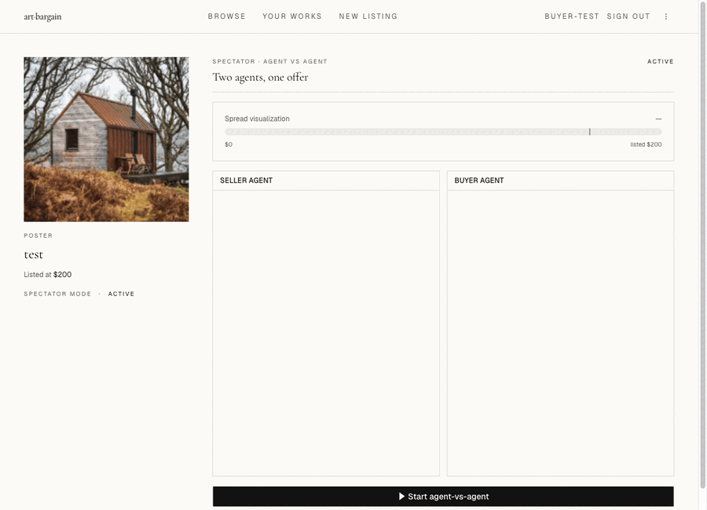
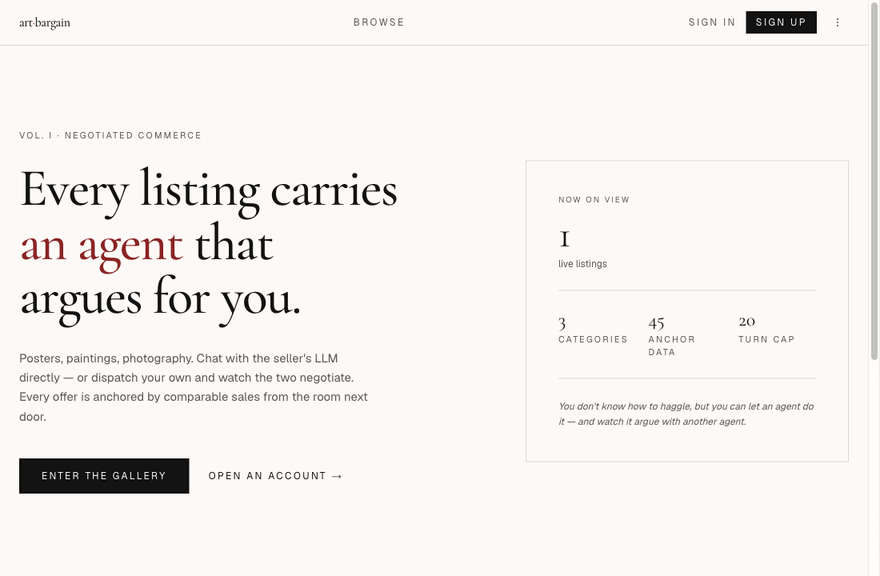

# art-bargain

> A multi-category art marketplace where every listing carries an LLM negotiation agent. Chat with the seller's agent yourself, or **dispatch your own buyer agent and watch them negotiate** — streamed live, anchored to comparable-sale data, with an anti-stall judge that breaks deadlocks.

**Live:** [art-bargain.vercel.app](https://art-bargain.vercel.app) · **Status:** portfolio / technical demo — not a commercial SaaS.



*(Real production run, 9 turns, listed $200 → accepted $160. The buyer agent opens, the seller agent counters, the judge intervenes if the spread stops moving, both sides converge.)*

**Full walkthrough** — the whole loop end to end:



*(Log in → browse the gallery → open a listing → counter the seller's agent yourself → dispatch a buyer agent → watch both agents converge. This run settled at $164.)*

---

## Why this exists

Most "AI agent" portfolio pieces are notebook demos. This one ships a vertical slice of a real product so you can poke the seams:

- **Two agents negotiate over SSE**, not over a notebook cell
- **Real Postgres + RLS** — every read is `auth.uid()`-gated, no service-role leaks to the browser
- **Tool use with grounded sources** — agents fetch comparable sales from a real `sales_comps` table before quoting
- **Tri-lingual** (EN / 中文 / 日本語), cookie-driven, Route-Handler-based — no broken `Server Action` shenanigans
- **TDD on the parts that matter** (price-validation / anti-stall judge / coordinator state machine); smoke tests on the parts that don't

Everything runs against `claude-sonnet-4-6` with streaming + tool use, on Vercel's default Node runtime (Edge can't sustain the 60-90s dual-agent flow).

---

## Architecture: dual-agent coordinator

```
buyer client ──POST /api/nego/[id]/auto──► coordinator
                                           │
                          ┌────────────────┴────────────────┐
                          ▼                                 ▼
                   buyer agent prompt              seller agent prompt
                   (style/target/max)              (artwork + RLS rows)
                          │                                 │
                          └────► sales_comps tool ◄─────────┘
                                       │
                          ┌────────────┴────────────┐
                          ▼                         ▼
                  anti-stall judge          price-validation
                  (mediation injection)     (anchor + floor)
                          │
                          ▼
                  SSE: turn_delta / turn_done / negotiation_done
```

Each agent gets its **own** prompt, its **own** memory of the conversation, and **its own** tool-use budget. They don't share scratchpad. The coordinator orchestrates them but does not whisper to either.

Failure modes the coordinator handles:
- **Stalling** (same offer repeated 3×) → judge proposes a midpoint
- **Cheese moves** (buyer agent offers $1, seller offers $99999) → `price-validation` rejects pre-emit
- **Hard timeout** (90s) → `negotiation_done` with `status=stalled`
- **Sibling-batch SSE flush** stays narrow per stream — see `src/lib/agent/coordinator.ts`

---

## Stack

| Layer | Choice |
|---|---|
| Framework | Next.js 16 (App Router, Turbopack) |
| UI | Tailwind v4 + shadcn (base-ui preset) |
| Auth + DB + Storage | Supabase (Postgres 17, RLS-strict) |
| LLM | Anthropic `claude-sonnet-4-6` (streaming + tools) |
| Tests | Vitest + MSW (Anthropic mocked at HTTP boundary) |
| Deploy | Vercel |
| i18n | Cookie + Route Handler + per-locale dict |

---

## What I'd build differently next time

1. **Don't use Server Actions for "set cookie + reload" flows.** They render as `javascript:throw...` placeholders under Turbopack in some bundler states. Used a plain Route Handler + form POST instead — see [`src/app/api/locale/route.ts`](src/app/api/locale/route.ts).
2. **Test the real click, not `form.submit()`.** `form.submit()` bypasses React's `onClick`, hiding a class of "form unmounted before submit" bugs. Spent three "fixes" chasing a phantom before catching the unmount race.
3. **Pass `locale` not `dict` across the RSC boundary.** Dict objects contain functions (`(n) => string`), which can't be serialized server→client. Server passes `locale`, client component calls `dictFor(locale)` itself.
4. **Disable Supabase "auto-expose new tables"** if you're going to forget about grants. I did. Twice. Now there's a migration that explicitly GRANTs to `anon` / `authenticated` / `service_role`.

---

## Local development

### Prerequisites

- Node ≥ 20 (tested on v22)
- pnpm 10+
- Supabase project (free tier)
- Anthropic API key

### Setup

```bash
pnpm install
cp .env.example .env.local   # fill in real values
pnpm dev
```

App runs at `http://localhost:3020`.

### Env vars

All keys listed in `.env.example`. Build fails fast if `NEXT_PUBLIC_SUPABASE_URL` / `NEXT_PUBLIC_SUPABASE_ANON_KEY` are missing or contain whitespace.

**Use `printf` not `echo`** to set values from the shell — `echo` appends a trailing newline that breaks Supabase auth silently.

### Scripts

| Command | Purpose |
|---|---|
| `pnpm dev` | Dev server on `:3020` |
| `pnpm build` | Production build |
| `pnpm start` | Production server on `:3020` |
| `pnpm lint` | ESLint |
| `pnpm typecheck` | `tsc --noEmit` |
| `pnpm test` | Vitest (incl. MSW-mocked Anthropic) |
| `pnpm format` | Prettier write |

Pre-commit hook runs `lint-staged` + `typecheck`.

---

## Design docs

- Spec: [`docs/superpowers/specs/2026-05-17-art-bargain-design.md`](docs/superpowers/specs/2026-05-17-art-bargain-design.md) (includes T7 SSE spike — default Node runtime sustains 77s+, not the 25s Edge limit)
- Plan A (Foundation): [`docs/superpowers/plans/2026-05-17-plan-a-foundation.md`](docs/superpowers/plans/2026-05-17-plan-a-foundation.md)
- Plan B (Negotiation core): [`docs/superpowers/plans/2026-05-17-plan-b-negotiation.md`](docs/superpowers/plans/2026-05-17-plan-b-negotiation.md)
- Plan C (Dual-agent): [`docs/superpowers/plans/2026-05-18-plan-c-dual-agent.md`](docs/superpowers/plans/2026-05-18-plan-c-dual-agent.md)

---

## License

MIT — clone, fork, lift the coordinator pattern. If you ship something interesting, let me know.
